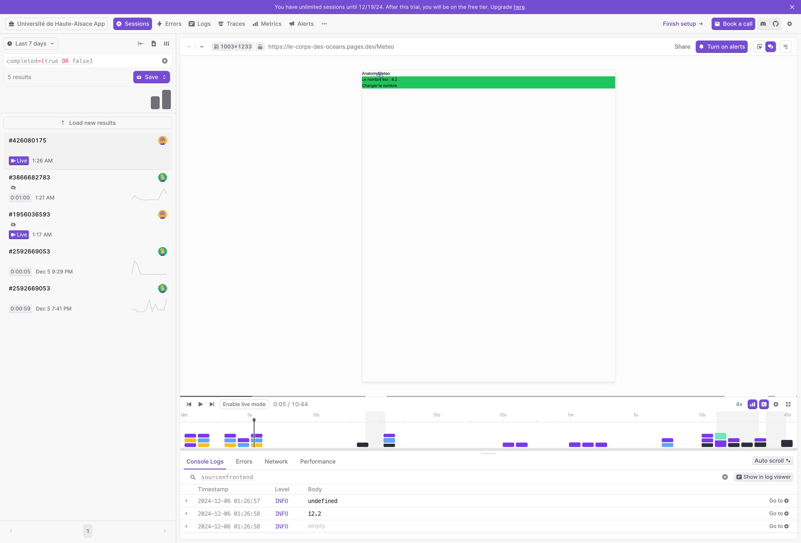
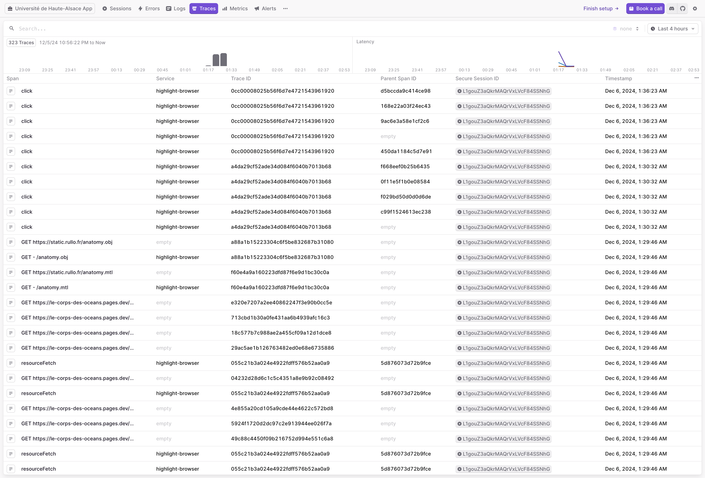

# Introduction

Dans le cadre de la gestion et de la supervision des applications web modernes, garantir la
disponibilité et les performances est une priorité absolue. Les utilisateurs s'attendent à une
expérience fluide et sans interruptions, tandis que les équipes techniques ont besoin d'outils
robustes pour identifier et résoudre rapidement les problèmes potentiels. Le monitoring devient
alors un élément clé pour assurer le bon fonctionnement d’une application, en fournissant des
indicateurs précis sur son état et son utilisation.

L'application Angular réalisé lors de la nuit de l'info est déployée sous forme de fichiers
statiques sur Cloudflare Pages, un service performant pour héberger des applications front-end sans
serveur. Cette architecture simplifiée, sans backend dédié, réduit la complexité des déploiements
mais pose également des défis spécifiques en matière de monitoring. En effet, l’absence d’un serveur
centralisé nécessite une solution capable de se concentrer exclusivement sur le comportement du
client, tout en capturant les erreurs, les performances et les interactions utilisateur directement
depuis le navigateur.

Pour répondre à ces besoins, le choix s’est porté sur Highlight, une solution de monitoring
open-source. Highlight permet de collecter et d’analyser en temps réel les erreurs, les sessions
utilisateur et les performances, tout en s'intégrant parfaitement à une application Angular. Ce
choix s'inscrit dans une démarche visant à privilégier des outils libres, en adéquation avec les
principes de transparence, de flexibilité et de maîtrise des coûts.

Nous nous concentrerons sur la mise en place d’une solution de supervision complète pour cette
application Angular.
La solution répondra aux questions clés telles que:

- Est-ce que l'application est toujours disponible ?
- Les utilisateurs rencontrent-ils des problèmes de performances ou des erreurs ?
- Comment prouver le bon fonctionnement de l’application à un instant donné ?
- Enfin, l'objectif ultime est de démontrer comment la mise en œuvre d’un outil de monitoring
  open-source comme Highlight permet non seulement d’assurer une Super Vision efficace, mais aussi
  d'améliorer l'expérience utilisateur et la gestion des incidents.

# I. Analyse des besoins en monitoring

## 1.1 Questions clés à résoudre

Le monitoring d’une application web est essentiel pour répondre à plusieurs interrogations critiques
concernant son fonctionnement:

- **Qui fait quoi ?**  
  Traçabilité des actions des utilisateurs pour comprendre leur parcours, détecter les comportements
  anormaux et identifier les points de friction.

- **Quoi fait qui ?**  
  Surveillance du comportement de l’application, notamment les erreurs JavaScript, les appels réseau
  échoués, ou encore les problèmes de rendu.

- **L’application est-elle UP ?**  
  Vérification que l’application est disponible et accessible depuis n’importe quel endroit.

- **L’application fonctionne-t-elle correctement ?**  
  Détection des erreurs qui pourraient perturber l’expérience utilisateur, comme des
  dysfonctionnements liés à des fichiers statiques manquants ou mal configurés.

- **L’application est-elle performante ?**  
  Analyse de la vitesse de chargement des pages, des temps de réponse des appels réseau, et de la
  fluidité globale de l’interface utilisateur.

- **Comment prouver que tout fonctionne ?**  
  Collecte de métriques fiables et traçabilité des événements pour fournir des preuves tangibles de
  la disponibilité et des performances de l’application.

---

## 1.2 Contraintes spécifiques de l’application Angular

L’application Angular étudiée présente une architecture particulière :

- **Pas de backend dédié:** les fichiers statiques sont déployés sur **Cloudflare Pages**, ce qui
  simplifie l’infrastructure mais limite les points de contrôle traditionnels.
- **Exécution côté client uniquement:** tout le monitoring doit se faire dans le navigateur, en
  capturant directement les événements et les erreurs sur le frontend.

Ces contraintes nécessitent une solution capable de :

- Se concentrer sur les erreurs JavaScript et les problèmes de performances frontend.
- Surveiller les interactions utilisateur sans dépendre d’un serveur backend.
- Offrir des métriques adaptées à une architecture 100% côté client.

---

## 1.3 Objectifs de la supervision

Pour répondre aux besoins identifiés, la solution de monitoring doit permettre :

1. **Surveillance des erreurs en temps réel**
    - Détecter les erreurs JavaScript (stack trace, source des erreurs).
    - Identifier les appels réseau échoués (statut HTTP).

2. **Analyse des performances**
    - Temps de chargement des fichiers statiques (HTML, CSS, JS).
    - Fluidité de l’interface (FPS, temps d’interaction).

3. **Suivi des interactions utilisateur**
    - Enregistrement des sessions pour comprendre les parcours utilisateur.
    - Collecte des événements critiques (clics, navigation).

4. **Mise en place d’alertes et de rapports**
    - Notifications en cas d’erreurs critiques ou de baisse significative des performances.
    - Rapports consolidés pour prouver la disponibilité et le bon fonctionnement de l’application.

---

## 1.4 Choix d’une solution open-source

L’exigence d’une solution open-source repose sur plusieurs avantages:

- **Transparence et maîtrise des données:** tout le code est accessible, offrant une flexibilité
  totale.
- **Adaptabilité:** possibilité d’héberger et de configurer la solution selon les besoins
  spécifiques.

Parmi les solutions open-source disponibles, **Highlight** a été retenu pour sa capacité à :

- Surveiller efficacement les applications web front-end.
- Capturer les erreurs et les performances en temps réel.
- Offrir des dashboards intuitifs pour analyser les sessions utilisateur.

---

# II. Présentation de Highlight

## 2.1 Qu’est-ce que Highlight ?

**Highlight** est une solution de monitoring open-source spécialement conçue pour les applications
web modernes. Elle offre un éventail de fonctionnalités permettant de surveiller le comportement des
applications côté client, tout en fournissant des outils pour diagnostiquer les problèmes de
performances et d'expérience utilisateur.

### Fonctionnalités principales

1. **Capture des erreurs**
    - Détection automatique des erreurs JavaScript (exceptions non gérées, erreurs réseau, etc.).
    - Fourniture de détails tels que la stack trace et le contexte d’exécution pour un diagnostic
      rapide.

2. **Analyse des performances**
    - Mesure des temps de chargement des fichiers (HTML, CSS, JS).
    - Suivi des indicateurs clés, comme le temps d'interaction ou les frames par seconde (FPS).

3. **Session Replay (Relecture des sessions)**
    - Enregistrement visuel des sessions utilisateur pour une analyse approfondie des interactions.
    - Identification des parcours utilisateur menant à des erreurs ou des comportements inattendus.

4. **Dashboard intuitif**
    - Visualisation en temps réel des métriques de santé de l’application.
    - Filtres pour explorer les événements par type (erreurs, performances, sessions).

---

## 2.2 Pourquoi Highlight pour cette application Angular ?

### Adaptation à une architecture sans backend

Highlight se distingue par sa capacité à surveiller efficacement des applications déployées sous
forme de fichiers statiques. Pour une application Angular hébergée sur **Cloudflare Pages**, ses
avantages incluent:

- L'absence de dépendances côté serveur, ce qui correspond parfaitement à une architecture 100 %
  frontend.
- La capture des erreurs et des événements directement depuis le navigateur utilisateur.

### Simplicité d’intégration

Highlight propose un SDK dédié pour Angular, permettant une intégration rapide et personnalisable.
En quelques étapes simples, il est possible de configurer le tracking des erreurs et des
performances.

### Respect des exigences open-source

En tant que solution open-source, Highlight garantit :

- **La transparence** : tout le code source est accessible, permettant des vérifications et des
  personnalisations.
- **L’indépendance** : possibilité d’auto-héberger la solution pour une maîtrise totale des données.
- **L’économie** : aucune licence payante, contrairement à des outils propriétaires tels que Sentry.

---

## 2.3 Comparaison avec des alternatives

Pour justifier le choix de Highlight, voici une comparaison avec deux autres solutions connues :

| Critères                | **Highlight** | **Sentry**                               | **Prometheus**        |
|-------------------------|---------------|------------------------------------------|-----------------------|
| **Open-source**         | Oui           | Partiellement (version gratuite limitée) | Oui                   |
| **Ciblé frontend**      | Oui           | Oui                                      | Non (surtout backend) |
| **Session Replay**      | Oui           | Oui                                      | Non                   |
| **Installation facile** | Oui           | Oui                                      | Complexe              |
| **Auto-hébergement**    | Oui           | Oui                                      | Oui                   |

Highlight est donc le choix idéal pour une application Angular sans backend, offrant des
fonctionnalités avancées tout en respectant les contraintes d’un projet open-source.

---

## 2.4 Fonctionnement général de Highlight

### Architecture de Highlight

Highlight s’appuie sur une architecture légère et flexible:

1. **SDK intégré dans l’application Angular** :
    - Capture des événements (erreurs, logs, sessions).
    - Envoi des données vers un serveur de collecte.

2. **Serveur de collecte (auto-hébergé ou cloud)** :
    - Centralisation et stockage des événements.
    - Analyse des données pour alimenter le dashboard.

3. **Dashboard utilisateur** :
    - Interface web

---

# III. Mise en œuvre de Highlight

## 3.1 Préparation de l’environnement

Avant d’intégrer Highlight dans l’application Angular, certaines étapes de configuration sont
nécessaires pour garantir une installation et un déploiement efficaces.

### 3.1.1 Pré-requis techniques

- **Application Angular** : une application fonctionnelle déployée sur Cloudflare Pages.
- **Accès à Highlight** : un compte Highlight ou un serveur auto-hébergé configuré.
- **Permissions nécessaires** : droits pour modifier le code source de l'application et déployer des
  mises à jour.

### 3.1.2 Création du projet Highlight

1. Inscription sur la plateforme Highlight (si utilisation de leur cloud).
2. Création d’un nouveau projet pour l’application Angular.
3. Récupération du **Project ID** unique, nécessaire pour l’intégration.

### 3.1.3 Installation du SDK Angular

Ajout du package npm Highlight au projet Angular :

```bash
pnpm add highlight.run
```

Intégration du SDK dans le module principal de l’application :

```typescript
import {H} from 'highlight.run';

H.init('aaabbbccc', {
  environment: 'production',
  networkRecording: {
    enabled: true,
    recordHeadersAndBody: true,
  },
});
```

### 3.1.4 Choix de la version cloud

Dans le cadre de la **Nuit de l'Info**, où le temps alloué au développement est extrêmement limité,
nous avons opté pour l'utilisation de la **version cloud** d'Highlight.

Cette décision permet de :

- **Économiser du temps** : pas besoin de configurer et de déployer un serveur auto-hébergé.
- **Simplifier la mise en œuvre** : la version cloud offre un environnement prêt à l’emploi,
  nécessitant uniquement l’intégration du SDK dans le projet Angular.
- **Accéder rapidement aux métriques** : le tableau de bord est immédiatement opérationnel, offrant
  une visibilité en temps réel sur les performances et les erreurs.

Cependant, pour une utilisation à long terme ou dans un contexte nécessitant un contrôle total des
données, l’auto-hébergement pourrait être envisagé.

---

# IV. Analyse des résultats et perspectives d'amélioration

## 4.1 Résultats obtenus

### 4.1.1 Surveillance des erreurs


L'intégration de Highlight a permis de capturer et d'analyser plusieurs types d'erreurs dans l'
application Angular, notamment:

- **Erreurs JavaScript** : exceptions non gérées dans des composants critiques.
- **Erreurs réseau** : requêtes échouées (codes 404 et 500), permettant d’identifier des fichiers ou
  manquants.
- **Problèmes spécifiques aux utilisateurs** : erreurs sur des navigateurs ou appareils spécifiques.

Ces informations permettent de corriger rapidement les anomalies détectées, améliorant ainsi la
fiabilité de l’application.

### 4.1.2 Relecture des sessions utilisateur




La fonctionnalité de relecture des sessions a permis de visualiser :

- Les comportements réels des utilisateurs.
- Les étapes du parcours où des ralentissements ou abandons surviennent.
- Les scénarios menant à des erreurs, facilitant leur reproduction et leur résolution.

### 4.1.3 Analyse des performances

Highlight a fourni des métriques clés, telles que :

- **Temps de chargement** des fichiers statiques (HTML, CSS, JS).
- **Indicateurs de performance utilisateur** (First Contentful Paint, Time to Interactive, etc.).  
  Ces données ont mis en évidence des opportunités d’optimisation, notamment en compressant certains
  fichiers et en configurant un meilleur cache.

---

## 4.2 Points positifs

- **Rapidité de mise en œuvre** : l’utilisation de la version cloud d’Highlight a permis une
  intégration immédiate.
- **Visibilité en temps réel** : les erreurs et métriques sont consultables instantanément sur le
  dashboard.
- **Amélioration de l’expérience utilisateur** : la détection rapide des anomalies a conduit à des
  corrections immédiates.
- **Adaptation à l’architecture statique** : Highlight s’est avéré parfaitement adapté pour une
  application Angular hébergée sans backend.

---

## 4.3 Limites rencontrées

### 4.3.1 Dépendance à la version cloud

Bien que pratique, la version cloud d'Highlight soulève des préoccupations :

- **Dépendance à une solution externe** pour la collecte et le stockage des données.
- **Potentiel risque de confidentialité** si des données sensibles sont accidentellement capturées.

### 4.3.2 Coût en production

Dans un contexte de production avec un volume élevé d’utilisateurs, la version cloud pourrait
générer des coûts supplémentaires pour le stockage des sessions et des logs.

### 4.3.3 Volume de données collectées

Les sessions utilisateur et les métriques réseau génèrent un volume important de données,
nécessitant une gestion fine pour éviter une surcharge inutile.

---

## 4.4 Perspectives d’amélioration

### 4.4.1 Migration vers une version auto-hébergée

Pour un projet à long terme ou en production, l'auto-hébergement d'Highlight permettrait :

- **Un contrôle total des données**.
- **Une meilleure maîtrise des coûts**, en supprimant la dépendance au modèle SaaS.

### 4.4.2 Filtrage et anonymisation des données

- Implémenter un **filtrage plus strict** pour éviter la capture de données sensibles (par exemple,
  via des options du SDK).
- Activer des fonctionnalités d'**anonymisation** pour protéger la confidentialité des utilisateurs.

### 4.4.3 Optimisation des performances

Sur la base des métriques collectées, certaines optimisations peuvent être envisagées :

- Allègement des ressources statiques (modèles 3D, images).
- Compression supplémentaire des fichiers CSS et JS.
- Mise en place d'une stratégie de cache plus efficace sur Cloudflare Pages.

---

## 4.5 Conclusion de la partie

L'intégration de Highlight dans l’application Angular a démontré l'importance du monitoring dans un
projet web. Malgré quelques limites, les résultats obtenus ont permis d’améliorer la qualité de
l’application tout en identifiant des axes de progression. En combinant Highlight avec des pratiques
de développement rigoureuses et d'autres outils open-source, il est possible de créer une solution
de supervision encore plus robuste et adaptée aux besoins futurs.

# V. Bibliographie et références

Dans cette section, nous répertorions toutes les sources et références utilisées pour l'élaboration
de ce mémoire, ainsi que des ressources supplémentaires pouvant être utiles pour les lecteurs
intéressés par les technologies et concepts abordés.

## 5.1 Sources documentaires

- **Highlight Documentation** : Documentation officielle de Highlight pour l'intégration et l'
  utilisation du service.  
  Lien : [https://highlight.io/docs](https://highlight.io/docs)

- **Angular Documentation** : Guide officiel pour le développement d'applications avec Angular.  
  Lien : [https://v18.angular.dev/](https://v18.angular.dev/)

- **Cloudflare Pages Documentation** : Documentation sur l'utilisation de Cloudflare Pages pour
  héberger des sites statiques.  
  Lien : [https://developers.cloudflare.com/pages](https://developers.cloudflare.com/pages)

- **Sentry Documentation** : Comparaison entre Highlight et Sentry pour les erreurs et le suivi des
  performances.  
  Lien : [https://docs.sentry.io](https://docs.sentry.io)

- **Prometheus Documentation** : Guide sur la mise en place de Prometheus pour la surveillance des
  métriques système et des performances.  
  Lien : [https://prometheus.io/docs](https://prometheus.io/docs)

## 5.2 Outils et bibliothèques utilisés

- **Highlight** : Solution de monitoring open-source utilisée pour la surveillance des erreurs et
  des performances.  
  Lien : [https://highlight.run](https://highlight.run)

- **Cloudflare Pages** : Plateforme de déploiement pour héberger des sites statiques et des
  applications frontend.  
  Lien : [https://www.cloudflare.com/products/pages](https://www.cloudflare.com/products/pages)

- **Angular** : Framework de développement d’applications web utilisées dans ce projet.  
  Lien : [https://angular.io](https://angular.io)

- **Node.js** : Environnement d'exécution JavaScript utilisé pour les outils de développement et le
  backend.  
  Lien : [https://nodejs.org](https://nodejs.org)

- **GitHub Actions** : Outil pour l'automatisation des workflows de déploiement et de CI/CD.  
  Lien : [https://docs.github.com/en/actions](https://docs.github.com/en/actions)

---

## 5.3 Normes et bonnes pratiques

- **Google Web Vitals** - Guide de Google pour mesurer la performance d'un site web selon les
  critères essentiels.  
  Lien : [https://web.dev/vitals/](https://web.dev/vitals/)
